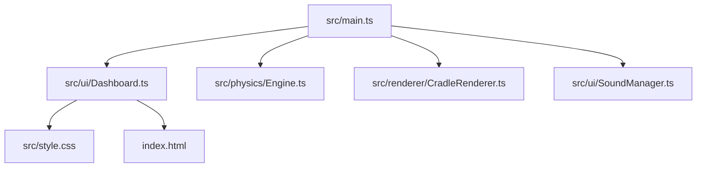

# خطة العمل: تحديث وتحسين محاكاة بندول نيوتن ثلاثية الأبعاد

تركز هذه الخطة على حل المشاكل الحالية في المشروع وتطبيق تحسينات متقدمة تجعل المحاكاة ذات طابع علمي وجمالي مميز.

---

## المشاكل المحددة والحلول المقترحة

### 1. مشكلة تعديل عدد الكرات
- **السبب**: عند تغيير شريط تمرير عدد الكرات، يقوم الحدث باستدعاء `loadPreset(presetSelect.value)`. داخل هذه الدالة، يتم إعداد الكتل والزوايا الافتراضية عبر `createConfig(5)` وتهيئة `initialAngles` بـ 5 عناصر دائماً، مما يتجاهل القيمة المدخلة ويعيد عدد الكرات قسراً إلى 5 كرات.
- **الحل**: تعديل دالة `loadPreset` لتقبل وسيطاً اختيارياً لعدد الكرات `customBallCount`. وإذا لم يُمرر، يتم قراءته ديناميكياً من شريط التمرير الحالي. سيتم أيضاً تعديل توليد الزوايا والكتل لتتكيف تلقائياً مع أي عدد كرات يتم اختياره (من 2 إلى 8) لكل حالة جاهزة (Preset).

### 2. تعديل الألوان لتكون مريحة بصرياً وعلمياً
- **السبب**: ألوان الكرات الحالية رمادية كروم موحدة، ولا تقدم أي معلومات علمية.
- **الحل**: إضافة خيار في لوحة التحكم لتحديد "نظام الألوان" (Color Scheme) يحتوي الخيارات التالية:
  1. **الكروم الكلاسيكي (Classic Chrome)**: مظهر معدني عاكس مع إضاءة محيطة ناعمة.
  2. **مخطط الطاقة العلمي (Energy Map)**: تتغير ألوان الكرات ديناميكياً بناءً على نوع الطاقة المهيمنة عليها:
     - أزرق داكن/رمادي عند السكون.
     - **سماوي متوهج (Cyan)** عند امتلاك طاقة كامنة عالية (الكرات المرتفعة).
     - **وردي متوهج (Pink)** عند امتلاك طاقة حركية عالية (الكرات السريعة).
     - يعكس هذا بدقة الألوان المستخدمة في منحنيات الرسم البياني لتسهيل الربط البصري العلمي.
  3. **خريطة انتشار السرعة (Velocity Heatmap)**:
     - كحلي داكن عند السكون، ويتحول إلى **البرتقالي/الأحمر المتوهج** مع زيادة السرعة. يوضح هذا بشكل رائع انتقال كمية الحركة والسرعة عبر الكرات المتوسطة أثناء التصادم.
  4. **ألوان الطيف (Rainbow)**: ألوان طيفية مبهجة ومريحة بصرياً تساعد في تمييز الكرات الفردية.

### 3. تعديل انخفاض المنحنى في الرسم البياني
- **السبب**: 
  1. قيمة `maxEnergy` الابتدائية في دالة الرسم البياني محدودة بـ `0.05` كحد أدنى. طاقة البندول الافتراضية عند التأرجح لكرتين أو كرة واحدة تكون صغيرة جداً (حوالي `0.007` جول)، مما يجعل المنحنيات تظهر منخفضة جداً ومسطحة وقريبة من الصفر.
  2. الارتفاع الثابت للوحة التحليلات هو `180px` وهو ضئيل نسبياً على الشاشات الحديثة.
- **الحل**:
  1. تقليل الحد الأدنى لـ `maxEnergy` إلى `1e-5` لتتمدد المنحنيات تلقائياً وتملأ المحور الصادي بالكامل وتوضح التغيرات بدقة علمية متناهية.
  2. زيادة ارتفاع لوحة الرسم البياني `.analytics-panel` في ملف CSS إلى `240px` لتحسين إمكانية القراءة البصرية.

### 4. إضافات علمية وإبداعية مميزة
نقترح إضافة الميزات التالية لترقية المشروع إلى أداة تعليمية وتفاعلية من الدرجة الأولى:
- **المؤثرات الصوتية للتصادم (Spatial Collision Audio)**:
  - توليد صوت نقرة معدنية واقعية (Click) عند حدوث أي تصادم باستخدام **Web Audio API** (دون الحاجة لملفات خارجية لضمان السرعة).
  - يتناسب مستوى الصوت (Volume) مع شدة التصادم (السرعة النسبية).
- **عرض متجهات الحركة (Motion Vectors)**:
  - إمكانية تفعيل أسهم ثلاثية الأبعاد (Vectors) تخرج من كل كرة:
    - **سهم أخضر** يمثل متجه السرعة ($v$).
    - **سهم أحمر** يمثل متجه التسارع/القوة ($a$).
    - تتمدد وتتقلص وتغير اتجاهها ديناميكياً مع الحركة.
- **تتبع المسار (Trajectory Trails)**:
  - رسم خط تتبع خلف الكرات (خاصة الطرفية) يوضح مسار حركتها في الفراغ ثلاثي الأبعاد لرصد مدى ثبات التأرجح في مسار قوسي مثالي.

---

## التعديلات المقترحة في الملفات

### [MODIFY] [index.html](file:///d:/مشروع الحسابات/index.html)
- إضافة خيار "نظام الألوان" (Color Scheme) في قسم الإعدادات الفيزيائية.
- إضافة خانات اختيار (Checkboxes) لتفعيل:
  - المؤثرات الصوتية.
  - مسارات الحركة (Trails).
  - متجهات الحركة (Vectors).
- تصحيح العنوان وتنسيق بعض النصوص.

### [MODIFY] [src/style.css](file:///d:/مشروع الحسابات/src/style.css)
- تعديل `.analytics-panel` ليكون بارتفاع `240px`.
- إضافة تنسيقات لعناصر واجهة المستخدم الجديدة (خانات الاختيار والخيارات الإضافية).
- تحسين التأثيرات الزجاجية (Glassmorphism) للأزرار وأشرطة التمرير واللوحات لجعلها فائقة الجمالية والجاذبية.

### [MODIFY] [src/physics/Types.ts](file:///d:/مشروع الحسابات/src/physics/Types.ts)
- إضافة `lastCollisionVelocity` في واجهة `CradleState` لنقل شدة التصادم إلى مولد الصوت.

### [MODIFY] [src/physics/Engine.ts](file:///d:/مشروع الحسابات/src/physics/Engine.ts)
- تعديل دالة `resolveCollisions` لحساب وتمرير أقصى سرعة نسبية للتصادم عبر `lastCollisionVelocity`.

### [NEW] [SoundManager.ts](file:///d:/مشروع الحسابات/src/ui/SoundManager.ts)
- إنشاء فئة `SoundManager` لتخليق المؤثرات الصوتية المعدنية للتصادم باستخدام الـ Web Audio API بشكل لحظي متزامن مع الفيزياء.

### [MODIFY] [src/ui/Dashboard.ts](file:///d:/مشروع الحسابات/src/ui/Dashboard.ts)
- تصحيح منطق حساب `maxEnergy` في الرسم البياني ليسمح بالقيم الصغيرة جداً، مما يحل انخفاض المنحنيات.
- تحديث الواجهة والـ Labels بالتحسينات الجديدة.

### [MODIFY] [src/renderer/CradleRenderer.ts](file:///d:/مشروع الحسابات/src/renderer/CradleRenderer.ts)
- تعديل خامات الكرات لتكون منفصلة ومستجيبة لنظام الألوان النشط.
- إدراج منطق تلوين الكرات ديناميكياً بناءً على (الطاقة أو السرعة).
- بناء وتحديث خطوط التتبع (Trails) والأسهم المتجهية (Vectors) للسرعة والتسارع وتحديثها في إطار الرسم.

### [MODIFY] [src/main.ts](file:///d:/مشروع الحسابات/src/main.ts)
- تعديل دالة `loadPreset` لتقبل تغيير عدد الكرات بحرية وديناميكية.
- ربط مدخلات الألوان، الصوت، المتجهات، والمسارات الجديدة بالـ Engine والـ Renderer.
- استدعاء تشغيل الصوت عند تفعيل خيار الصوت وحدوث تصادم في دورة المحاكاة الحية.

---

## خطة التحقق والتدقيق

### التحقق التلقائي واليدوي
1. تشغيل خادم التطوير (`npm run dev`) لمراقبة التغييرات الفورية في المتصفح.
2. التحقق من صحة بناء كود الـ TypeScript لضمان عدم وجود أخطاء في الأنواع (Types).
3. اختبار السيناريوهات التالية:
   - تغيير عدد الكرات من 2 إلى 8 والتحقق من صحة بناء البندول والمسافات الفاصلة بين الكرات.
   - التحقق من تمدد الرسم البياني وعلو منحنيات الطاقة وتغطيتها لكامل المساحة الرأسية المتاحة.
   - اختبار التفاعل بين الكرات وسماع نقرات الصوت عند التصادم بالسرعات المختلفة.
   - تفعيل متجهات السرعة والتسارع ومراقبة حركتها ومطابقتها للمتوقع فيزيائياً.
   - تجربة الألوان الأربعة والتحقق من التوهج والانتقال اللحظي أثناء الصدمات.
